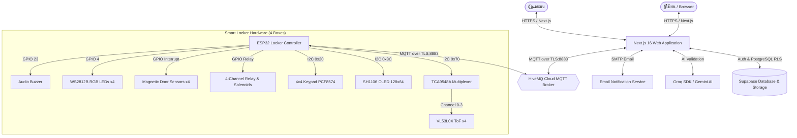

# 📦 LostReturn — Smart Locker System for Lost & Found

> **LostReturn** คือแพลตฟอร์มจัดการของหายและเก็บของได้แบบครบวงจร ที่ผสานเว็บแอปพลิเคชันยุคใหม่เข้ากับ **ตู้ล็อกเกอร์อัจฉริยะ (IoT Smart Locker)** เพื่อให้การส่งมอบของคืนแก่เจ้าของเป็นไปอย่างปลอดภัย ไร้การสัมผัส และตรวจสอบได้แบบ Real-time ตลอด 24 ชั่วโมง

---

## ✨ จุดเด่นและความสามารถ (Key Features)

### 🌐 ฝั่งเว็บแอปพลิเคชัน (Web Platform)
- **📋 Lost & Found Feed:** ระบบโพสต์แจ้งของหายและของที่เก็บได้ พร้อมระบบค้นหา ฟิลเตอร์หมวดหมู่ และการอัปโหลดรูปภาพ
- **🤖 AI Identity Verification:** ใช้ AI (Groq SDK / Gemini) ช่วยตรวจสอบคำตอบและคำอธิบายลักษณะสิ่งของ เพื่อยืนยันความเป็นเจ้าของที่แท้จริงก่อนปลดล็อกตู้
- **🔐 Smart Locker Integration:** 
  - สั่งปลดล็อกช่องตู้ผ่านหน้าเว็บเมื่อมาถึงหน้าตู้
  - สร้างรหัส OTP 6 หลักสำหรับให้เจ้าของไปกดรับของที่หน้าตู้ด้วยตนเอง
  - แสดงสถานะตู้ Real-time (ว่าง / มีของ / ประตูเปิด-ปิด / รหัส OTP พร้อมใช้งาน)
- **💬 Realtime Chat & Email Notification:** แชทคุยระหว่างเจ้าของและผู้พบของ พร้อมระบบแจ้งเตือนทางอีเมลอัตโนมัติผ่าน SMTP (Resend)
- **📊 Admin Dashboard:** แผงควบคุมสำหรับผู้ดูแลระบบ ติดตามสถานะตู้ทั้ง 4 ช่อง, ปลดล็อกฉุกเฉิน, ตรวจสอบ Transaction Logs และจัดการผู้ใช้งาน

### ⚡ ฝั่งตู้ล็อกเกอร์ฮาร์ดแวร์ (IoT ESP32 Firmware)
- **📟 Interactive OLED Display:** จอแสดงผล SH1106 (128x64) แสดงผลภาษาไทย พร้อมอนิเมชั่นหุ่นยนต์ AFK น่ารัก และคำแนะนำ 4 ขั้นตอน (ฝากของ / รับของ)
- **📏 High-Precision ToF Sensors:** ตรวจจับวัตถุในตู้ด้วยเซนเซอร์ Laser ToF `VL53L0X` x4 ผ่านชิปขยาย I2C `TCA9548A` พร้อมอัลกอริทึมกรองสัญญาณรบกวน (Adaptive Noise Floor & EMA Filter)
- **🚪 Magnetic Door Sensing:** ตรวจสอบสถานะการเปิด-ปิดประตูด้วย Reed Switch พร้อมวงจร Soft-debounce และระบบป้องกันสัญญาณรบกวนจากกระแสเหนี่ยวนำของโซลินอยด์ (Inductive Spikes Blackout)
- **⌨️ Secure Keypad Input:** แป้นพิมพ์ 4x4 กดป้อนรหัส OTP 6 หลัก พร้อมระบบ Lockout ชั่วคราวเมื่อกดผิดเกินกำหนด ป้องกันการ Brute-force
- **💡 Multi-Sensory Feedback:** หลอดไฟ LED NeoPixel `WS2812B` แยกแสดงสถานะแต่ละตู้ และลำโพง Buzzer ให้เสียงประกอบทุกจังหวะการกดและการทำรายการ
- **📶 Captive Portal Wi-Fi:** ตั้งค่าเชื่อมต่อ Wi-Fi ประจำสถานที่ผ่านโทรศัพท์มือถือด้วย `WiFiManager` โดยไม่ต้องเขียนโค้ดแก้รหัสผ่านใหม่

---

## 🏗️ สถาปัตยกรรมระบบ (System Architecture)



---

## 🛠️ เทคโนโลยีที่ใช้ (Tech Stack)

| ส่วนของระบบ | เทคโนโลยีที่เลือกใช้ |
| :--- | :--- |
| **Frontend Framework** | [Next.js](https://nextjs.org/) 16 (App Router), [React](https://react.dev/) 19, [TypeScript](https://www.typescriptlang.org/) |
| **Styling & UI** | [Tailwind CSS](https://tailwindcss.com/) v4, [Radix UI](https://www.radix-ui.com/), [Lucide React](https://lucide.dev/), [Framer Motion](https://www.framer.com/motion/) |
| **Database & Auth** | [Supabase](https://supabase.com/) (PostgreSQL, Row Level Security, Realtime Subscriptions) |
| **IoT Protocol** | [MQTT](https://mqtt.org/) over TLS (HiveMQ Cloud Broker), Node.js `mqtt` client |
| **AI & Notification** | [Groq SDK](https://groq.com/) (Llama 3), Google Generative AI, [Nodemailer](https://nodemailer.com/) |
| **Hardware Core** | ESP32 NodeMCU, Arduino Framework, `WiFiManager`, `PubSubClient`, `Adafruit_VL53L0X` |

---

## 📁 โครงสร้างโปรเจกต์ (Project Structure)

```text
LostReturn/
├── firmware/                       # ⚡ ซอร์สโค้ดสำหรับฮาร์ดแวร์ ESP32
│   ├── firmware.ino                # โค้ดหลัก Arduino ESP32 (MQTT, Keypad, เซนเซอร์)
│   ├── oled_bitmaps.h              # ข้อมูลภาพไอคอนและฟอนต์สำหรับจอ OLED
│   ├── secrets.h.example           # เทมเพลตสำหรับกรอกรหัส HiveMQ (ปลอดภัยสำหรับ Git)
│   ├── secrets.h                   # รหัสผ่านจริงในเครื่อง (ถูก ignore โดย Git)
│   └── README.md                   # คู่มือฮาร์ดแวร์ รายการไลบรารี และผังวงจร
├── src/
│   ├── app/                        # Next.js App Router (Pages & API Routes)
│   │   ├── api/                    # Backend API (Locker unlock, MQTT, AI verify, Email)
│   │   ├── admin/                  # หน้าแดชบอร์ดและจัดการตู้สำหรับผู้ดูแล
│   │   ├── auth/                   # หน้าเข้าสู่ระบบและสมัครสมาชิก
│   │   ├── claim/                  # หน้าตอบคำถามเพื่อเคลมสิ่งของ
│   │   ├── feed/                   # หน้ารวมฟีดของหายและของที่เก็บได้
│   │   ├── locker/                 # หน้าจอควบคุมการฝาก-รับของตู้ล็อกเกอร์
│   │   ├── post/                   # หน้าสร้างโพสต์ของหาย/ของที่พบ
│   │   └── profile/                # ข้อมูลผู้ใช้งานและประวัติ
│   ├── components/                 # React UI Components
│   ├── hooks/                      # Custom React Hooks (useAuth, useChat, useLocker)
│   ├── integrations/supabase/      # Supabase Client & Database Types
│   ├── lib/                        # Server Utilities (MQTT Client & Subscriber, Supabase Admin)
│   └── instrumentation.ts          # Next.js Server Lifecycle (Auto-start MQTT Background Services)
├── public/                         # Static Assets (Images, Icons)
├── .env.example                    # ตัวอย่าง Environment Variables สำหรับ Web App
├── .gitignore                      # กฎการคัดแยกไฟล์และปกป้อง Secrets
├── next.config.ts                  # การตั้งค่า Next.js & Turbopack
└── package.json                    # รายการ Dependencies และ Scripts
```

---

## 🚀 เริ่มต้นใช้งาน (Getting Started)

### 1. การติดตั้งฝั่ง Web Application

#### ข้อกำหนดเบื้องต้น:
- [Node.js](https://nodejs.org/) (เวอร์ชัน 20 หรือใหม่กว่า)
- [Git](https://git-scm.com/)

#### ขั้นตอนการติดตั้ง:
```bash
# 1. Clone repository
git clone https://github.com/Sittisak-uia/LostReturn.git
cd LostReturn

# 2. ติดตั้ง Dependencies
npm install

# 3. สร้างไฟล์ Environment Variables
cp .env.example .env.local
```

แก้ไขไฟล์ `.env.local` และระบุค่าของบริการต่างๆ ให้ครบถ้วน:

```env
# Supabase Database & Auth
NEXT_PUBLIC_SUPABASE_URL=https://your-project.supabase.co
NEXT_PUBLIC_SUPABASE_PUBLISHABLE_KEY=your-anon-key
SUPABASE_SERVICE_ROLE_KEY=your-service-role-key

# App URL
NEXT_PUBLIC_APP_URL=http://localhost:3000

# MQTT HiveMQ Cloud
MQTT_BROKER_URL=mqtts://your-cluster.s1.eu.hivemq.cloud:8883
MQTT_USERNAME=lostreturn_admin
MQTT_PASSWORD=your_password
```

#### เริ่มต้นรันเซิร์ฟเวอร์:
```bash
# รัน Development Server
npm run dev

# หรือตรวจสอบ Type และ Build โปรดักชัน
npx tsc --noEmit
npm run build
npm run start
```
เปิดบราวเซอร์ไปที่ [http://localhost:3000](http://localhost:3000)

---

### 2. การติดตั้งฝั่ง Hardware (ESP32)

1. เปิดโปรแกรม **Arduino IDE**
2. ติดตั้งบอร์ด **ESP32 by Espressif Systems** ผ่าน Boards Manager
3. ติดตั้งไลบรารีที่จำเป็นผ่าน Library Manager:
   - `WiFiManager` (by tzapu)
   - `PubSubClient` (by Nick O'Leary)
   - `ArduinoJson` (by Benoît Blanchon)
   - `Adafruit_VL53L0X`
   - `Adafruit_SH110X` & `Adafruit_GFX`
   - `I2CKeyPad` (by Rob Tillaart)
   - `Adafruit NeoPixel`
4. เข้าไปที่โฟลเดอร์ `firmware/` คัดลอก `secrets.h.example` เป็น `secrets.h` และใส่คีย์ MQTT
5. เสียบสาย USB เข้ากับบอร์ด ESP32 และกด **Upload**
6. ดูรายละเอียดผังวงจรขาและการใช้งานเพิ่มเติมได้ที่ [firmware/README.md](firmware/README.md)

---

## 📡 MQTT Topic Specification

| หัวข้อ Topic | ทิศทาง | ผู้ส่ง | รายละเอียดคำสั่ง / สถานะ |
| :--- | :---: | :---: | :--- |
| `lostreturn/locker/{id}/command` | `-->` | Web App | สั่งเปิดตู้ (`"OPEN"`), ส่งรหัส (`{"otp":"123456"}`), แจ้งผล (`{"action":"AUTH_SUCCESS"}`) |
| `lostreturn/locker/{id}/status` | `<--` | ESP32 | สถานะประตู (`{"doorState":"OPEN/CLOSED"}`), มีของในตู้ (`{"hasItem":true/false}`), กลอน (`{"solenoid":"UNLOCKED/LOCKED"}`), คีย์แพดสำเร็จ (`{"keypad":"SUCCESS"}`) |

---

## 💻 พัฒนาและคำสั่งทดสอบ (Available Scripts)

- `npm run dev` — สตาร์ท Local Development Server (พร้อม Turbopack)
- `npm run build` — คอมไพล์โปรเจกต์เป็น Production Bundle
- `npm run start` — สตาร์ท Production Server
- `npm run lint` — ตรวจสอบมาตรฐานโค้ดด้วย ESLint 9
- `npx tsc --noEmit` — ตรวจสอบ Type Safety ด้วย TypeScript Compiler

---

## 🛡️ ความปลอดภัยของข้อมูล (Security Notice)
- ไฟล์ที่มีข้อมูลสำคัญ (Credentials) เช่น `.env.local` และ `firmware/secrets.h` จะถูกละเว้นโดย Git ตลอดเวลา ห้ามทำการ Commit ไฟล์เหล่านี้ขึ้นสู่ Public Repository
- สิทธิ์การเข้าถึงข้อมูลใน Supabase ได้รับการปกป้องด้วย Row Level Security (RLS) ทั้งหมด

---

## 📄 License
This project is licensed under the MIT License - see the LICENSE file for details.
